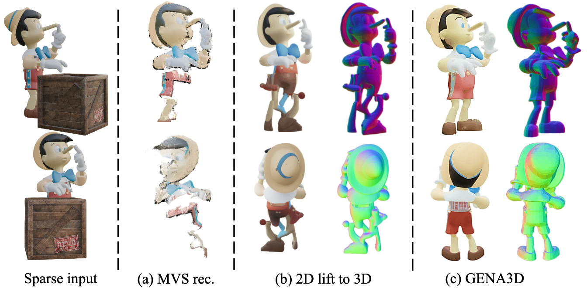
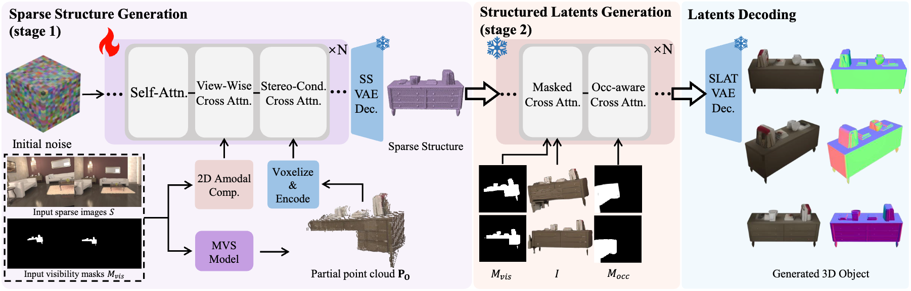
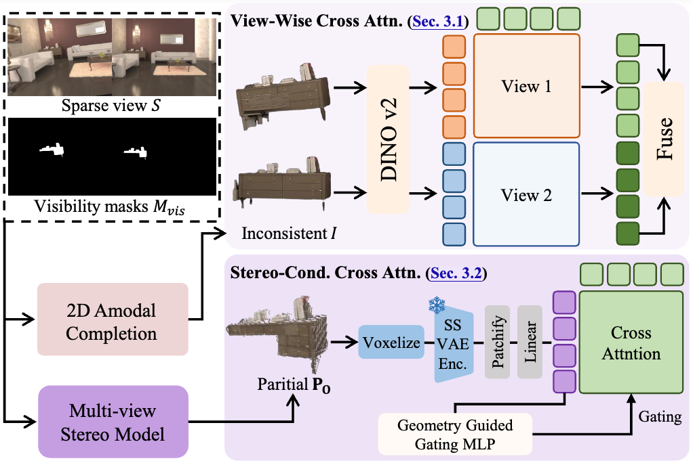
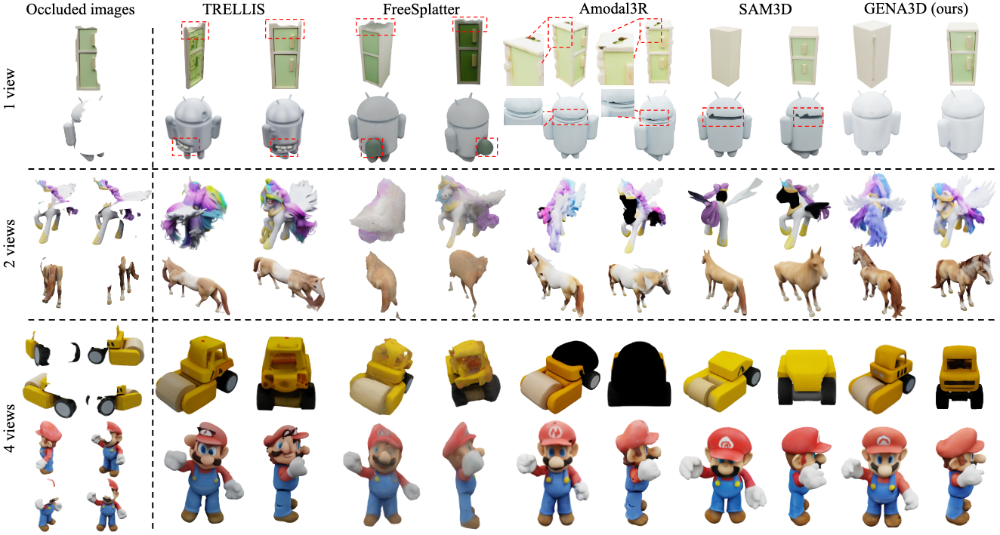
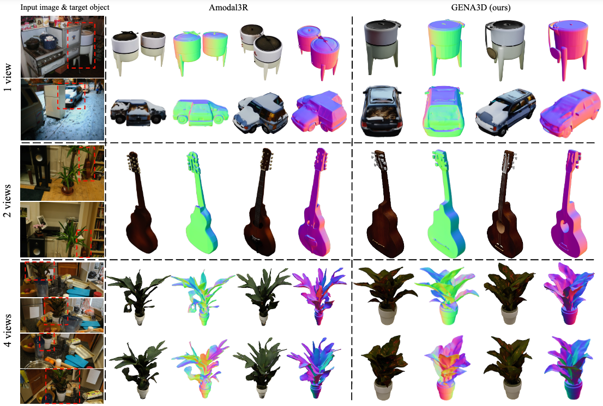

<div align="center">

<h2>GENA3D: Generative Amodal 3D Modeling by Bridging 2D Priors and 3D Coherence</h2>
<p><b>ECCV 2026</b></p>
<p>
<a href="https://colezwhy.github.io/" target="_blank">Junwei Zhou</a>,
<a href="https://yuwingtai.github.io/" target="_blank">Yu-Wing Tai</a>
</p>
<p>Dartmouth College</p>
</div>


>**TL;DR**: <em>GENA3D bridges 2D amodal completion and 3D generative modeling to achieve amodal 3D objects generation from sparse and paritial-occluded observations.</em>

<p align="center">
  <a href="https://colezwhy.github.io/gena3d/">
    
  </a>
  <a href="https://arxiv.org/abs/2511.21945">
    
  </a>
    <a href="#">
    
  </a>
</p>


Official implementation for paper 'GENA3D: Generative Amodal 3D Modeling by Bridging 2D Priors and 3D Coherence'.

Intergrating 2D amodal completion prior and 3D generative modeling ability in the latent 3D space to achieve amodal 3D objects generation from sparse and partial-occluded views, under various scenarios, including single object-level, in-the-wild and in-the-scene.

https://github.com/user-attachments/assets/6f4b36e1-c50d-436a-9241-bd0e700c809e


## Updates and TODOs
- ✔️ 12/04/2025: Initialize the project page.
- 🎊 06/18/2026: GENA3D is accepted to ECCV 2026.
- 🔲 TODO: The code will soon be released. Please stay tuned!


## Method 
<p align="center">
  
</p>

<p align="center">
  GENA3D bridges the 2D amodal completion with 3D generation using deliberaely designed View-Wise Cross Attention and Stereo-Conditioned Cross Attention in the Sparse Structure Generation Stage, with synthesized sparse-view 3D consistent occlusions as training data.
</p>

<p align="center">
  
</p>

<p align="center">
  A detailed illustration of our proposed ViewWise Cross Attention and Stereo-Conditioned Cross Attention modules.
</p>

## Results
<p align="center">
  
</p>

<p align="center">
  Results on GSO object-level synthetic dataset.
</p>

<p align="center">
  
</p>

<p align="center">
  Results on in-the-wild real-world captures.
</p>

## Citation
Here is the bibtex reference. If you find our work interesting or useful, please give us a :star: or cite our paper!
```
@misc{zhou2026gena3dgenerativeamodal3d,
      title={GENA3D: Generative Amodal 3D Modeling by Bridging 2D Priors and 3D Coherence}, 
      author={Junwei Zhou and Yu-Wing Tai},
      year={2026},
      eprint={2511.21945},
      archivePrefix={arXiv},
      primaryClass={cs.CV},
      url={https://arxiv.org/abs/2511.21945}, 
}
```
